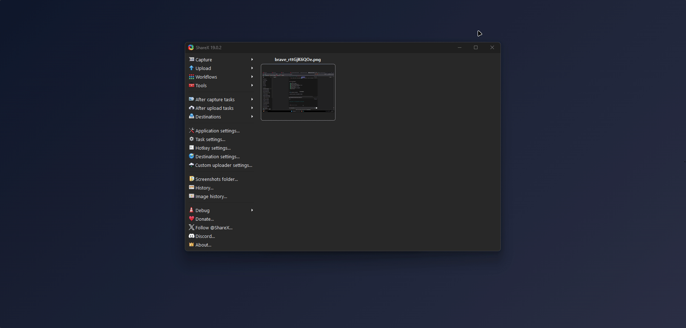

# 📚 Organizador de Estudos — Frontend

Interface web do sistema **Organizador de Estudos**.

Aplicação desenvolvida para gerenciamento de tarefas com sistema de notas e ranking de desempenho entre usuários.

🔗 **Acesse online:**  
https://organizador-frontend.vercel.app/

---

## 🎥 Demonstração

---

## 🚀 Funcionalidades

- ✅ Cadastro de usuário
- ✅ Login com autenticação JWT
- ✅ Criação de tarefas com descrição e nota
- ✅ Marcar tarefa como concluída
- ✅ Excluir tarefas
- ✅ Ranking por média de desempenho
- ✅ Logout seguro

---

## 🌐 Integração com Backend

A aplicação consome a API hospedada no Render:
