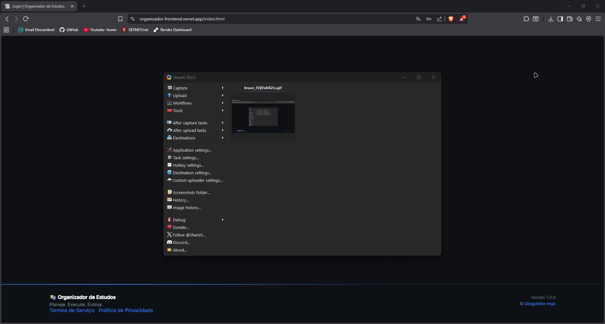

# 📚 Organizador de Estudos — Frontend

Interface web do sistema **Organizador de Estudos**, uma aplicação Full Stack desenvolvida para gerenciamento de tarefas com sistema de notas e ranking de desempenho entre usuários.

🔗 **Acesse o sistema online:**  
https://organizador-frontend.vercel.app/

---

## 🎥 Demonstração

---

## 🧠 Sobre o Projeto

O objetivo do projeto é permitir que usuários:

- Criem tarefas
- Adicionem notas de desempenho
- Marquem tarefas como concluídas
- Visualizem um ranking baseado na média das notas

A aplicação consome uma API REST hospedada no Render.

---

## 🚀 Funcionalidades

### 🔐 Autenticação
- Cadastro de novos usuários
- Login com geração de token JWT
- Armazenamento do token no `localStorage`
- Proteção de páginas privadas
- Logout seguro

---

### 📚 Gerenciamento de Tarefas
- Criar tarefa com:
  - Título
  - Descrição
  - Nota (opcional)
- Listar tarefas do usuário autenticado
- Marcar tarefa como concluída
- Excluir tarefa
- Atualização automática da lista

---

### 🏆 Ranking
- Lista todos os usuários
- Calcula média das notas
- Ordenação automática da maior para menor média

---

### 🤖 Integração com Inteligência Artificial

Permite gerar planos de estudo personalizados através da API:

- Seleção de matéria
- Nível de dificuldade
- Quantidade de horas por dia

Resultado exibido diretamente na interface.

Controle de limite diário aplicado pelo backend.

---
## 🌐 Integração com Backend

A aplicação consome a seguinte API:

